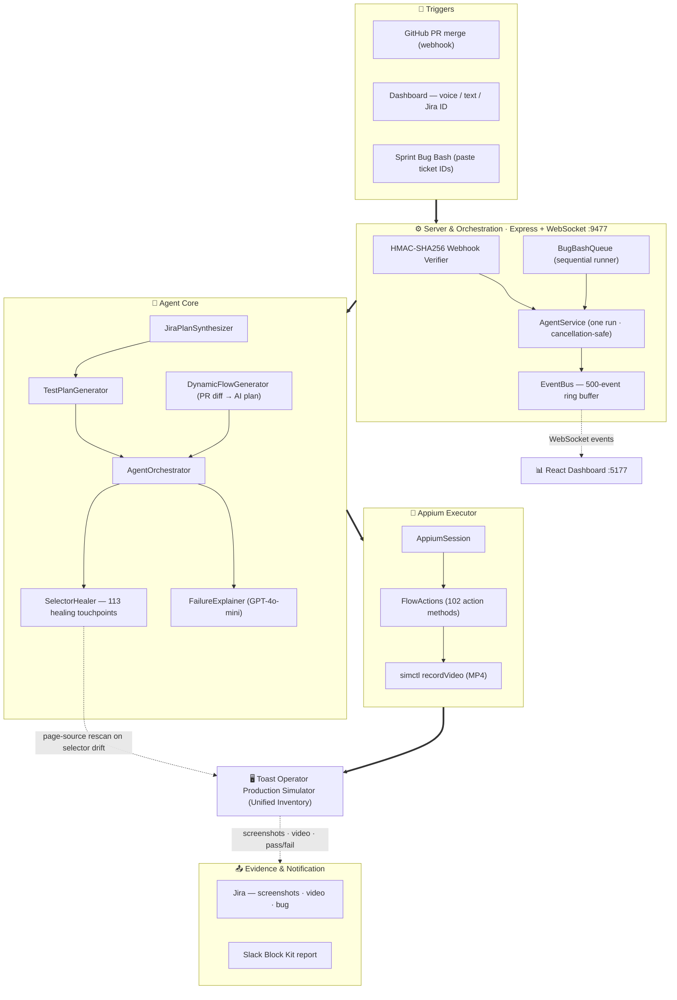

# ToastPilot — Onboarding Guide

> For anyone who wants to run, extend, or adapt ToastPilot. This document replaces reading all other MD files separately.

---

## Table of Contents

1. [What Is ToastPilot?](#1-what-is-toastpilot)
2. [How It Works End to End](#2-how-it-works-end-to-end)
3. [System Architecture](#3-system-architecture)
4. [Prerequisites](#4-prerequisites)
5. [Setup — New Team Member](#5-setup--new-team-member)
6. [Environment Variables Reference](#6-environment-variables-reference)
7. [Running the Agent](#7-running-the-agent)
8. [All 22 Test Flows](#8-all-22-test-flows)
9. [Autonomous PR-Merge Pipeline Setup](#9-autonomous-pr-merge-pipeline-setup)
10. [Extending to a New Feature (Same Module)](#10-extending-to-a-new-feature-same-module)
11. [Extending to a New iOS Module or App](#11-extending-to-a-new-ios-module-or-app)
12. [Extending to a Web/Non-iOS Team](#12-extending-to-a-webnon-ios-team)
13. [HTTP API Reference](#13-http-api-reference)
14. [Security Model](#14-security-model)
15. [Project Stats](#15-project-stats)

---

## 1. What Is ToastPilot?

ToastPilot is a **fully autonomous AI QA agent** for the **ToastUnifiedInventory** iOS module (Cycle Count, Product Catalog, Invoice Scanning). It does the work of a Senior QA Engineer — reading Jira changelogs, designing test plans, executing them on a real iOS Simulator, filing bugs with screenshots and video, and reporting results to the team — **without any human intervention**.

**The core problem it solves:** Every PR merged to ToastUnifiedInventory required someone to manually open Toast Operator, navigate through dozens of screens, and verify nothing broke. Hours of work, zero audit trail.

**What happens when a PR merges now:**

```
Developer merges PR → GitHub Actions detects merge
  → HMAC-signed webhook fires → ToastPilot server
  → Jira ticket fetched (summary, description, acceptance criteria)
  → Best test flow selected (or AI generates one from the PR diff)
  → Tests run against real Toast Operator Production on iOS Simulator
  → Screenshots + MP4 video captured at every step
  → Evidence attached to Jira automatically
  → Slack notification posted with pass/fail + links
  → If failed: Jira bug ticket created in one tap
```

No human was involved between the PR merge and the Slack notification.

**Key numbers:**
| Metric | Value |
|--------|-------|
| Lines of TypeScript | 14,320 across 48 files |
| Test flows | 22 |
| Action methods | 102 |
| Self-healing touchpoints | 113 |
| iOS modules covered | 3 (Cycle Count, Product Catalog, Invoice Scanning) |
| External integrations | 5 (Appium, OpenAI, Jira, Slack, GitHub) |

---

## 2. How It Works End to End

### The Execution Engine

At the core is `FlowActions.ts` — 2,210 lines, 102 action methods. Each method drives real iOS screens through XCUITest accessibility identifiers via Appium. The app runs on a local iOS Simulator with `AGENT_NO_RESET=true`, keeping the session warm (no repeated logins, no reCAPTCHA).

### Self-Healing (113 Touchpoints)

Selectors break when developers rename accessibility identifiers or refactor views. ToastPilot doesn't fail — it heals:

1. **Demo/legacy overrides** — known-broken IDs → verified replacements (O(1))
2. **Registry exact lookup** — `accessibility-registry.json` known IDs
3. **Action-specific defaults** — canonical selector per action name
4. **Prefix pattern matching** — `-ios predicate string:name BEGINSWITH prefix` for dynamic Swift IDs
5. **Fuzzy Levenshtein scan** — scores live page XML against the failed selector
6. **Swift repo scan** — reads `.accessibilityIdentifier()` calls from source as a last resort

Healed selectors are promoted back into `FlowActions.ts` so the same heal isn't needed twice.

### Dynamic Flow Generator

When no pre-built flow matches a Jira ticket:
1. Fetches the PR diff from GitHub Enterprise API (filtered to `ToastUnifiedInventory` files, truncated to 8,000 chars)
2. Sends diff + Jira ticket + acceptance criteria to GPT-4o
3. AI composes a test sequence using only the 102-action catalog — hallucinated actions are filtered out
4. Generated flow is persisted to `inventory-flows.json` and executed immediately
5. Backend-only diffs → Slack "needs manual testing" instead of a test run

### Feature Codegen (AI writes the test code)

When a developer ships a new feature with new Swift accessibility identifiers:

```bash
# Step 1: Scan Swift source → generate TypeScript selectors
npm run locators:generate

# Step 2: Generate all four test artifacts for the Jira ticket
npm run feature:generate -- --ticket=SMB-1234
```

OpenAI generates:
- New `async` action methods in `FlowActions.ts`
- New flow entry in `inventory-flows.json`
- New keyword mapping in `JiraPlanSynthesizer.ts`
- New handler entries in `AgentOrchestrator.ts`

Zero human code editing required. The next `run agent` picks up the new feature.

### Sprint Bug Bash

Replaces the manual sprint bug bash session:
1. Open the **Sprint Bug Bash** panel in the dashboard
2. Paste all sprint ticket IDs (any format — `SMB-123, SMB-124` or one per line)
3. Click **Run Bug Bash**

ToastPilot runs each ticket sequentially: Jira fetch → test plan synthesis → agent run → attach screenshots + MP4 → Jira comment → next ticket. Final aggregate Slack summary posted automatically.

---

## 3. System Architecture



**Key subsystems:**

| File | What it does |
|------|-------------|
| `server/index.ts` | All HTTP routes + HMAC webhook + build state machine |
| `server/AgentService.ts` | One active run at a time, cancellation-safe generation counter |
| `server/EventBus.ts` | Pub/sub with 500-event ring buffer + WebSocket fan-out |
| `server/BugBashQueue.ts` | Sequential sprint ticket runner |
| `agent/core/AgentOrchestrator.ts` | Step-execution loop, video recording, events |
| `agent/core/TestPlanGenerator.ts` | Intent matching → structured TestPlan |
| `agent/core/SelectorHealer.ts` | 6-strategy selector recovery |
| `agent/core/DynamicFlowGenerator.ts` | PR diff + OpenAI → custom test flow |
| `agent/core/FeatureCodegen.ts` | Jira AC + locators → full TS automation code |
| `agent/executor/FlowActions.ts` | 102 action methods (the engine) |
| `agent/executor/AppiumSession.ts` | Resilient WebDriverIO primitives |
| `agent/executor/LocatorCodegen.ts` | Swift source → generated-locators.ts + FlowActions.L |
| `knowledge/inventory-flows.json` | 22 named flow definitions |
| `knowledge/accessibility-registry.json` | Accessibility ID registry + healing strategies |
| `dashboard/src/App.tsx` | React dashboard — all panels and interaction handlers |

---

## 4. Prerequisites

All of these are already true for the ToastUnifiedInventory iOS team:

| Requirement | Notes |
|-------------|-------|
| **macOS** | M-series or Intel, macOS 13+ |
| **Xcode** | With iOS 18 Simulator |
| **iPhone 17 Pro** (or 16/15 Pro) simulator booted at least once | `run agent` auto-boots it |
| **Toast Operator Production** built and available | `npm run app:build` rebuilds; or build in Xcode and point `TOAST_OPERATOR_APP_PATH` at it |
| **Node.js 20+** | `node --version` to verify |
| **operator-app-ios repo cloned** | `setup-env.ts` auto-detects the path on `npm install` |

**First-time only:**
```bash
# Install Node.js if not present
brew install node

# Verify
node --version   # 20+
npm --version
```

You do **not** need to install Appium manually — `npm install` handles it.

---

## 5. Setup — New Team Member

### Step 1 — Clone and install

```bash
git clone https://github.toasttab.com/<your-org>/toastpilot-qa-agent.git
cd toastpilot-qa-agent
npm install
```

`npm install` runs three scripts automatically (`postinstall`):
- **`setup-env.ts`** — scans `~/Documents/GitHub` for `operator-app-ios`, finds `ToastOperator.app`, writes `.env` with shared team credentials + detected paths
- **`setup-appium.ts`** — installs the XCUITest driver (`appium-xcuitest-driver`)
- **`install-alias.sh`** — adds the `run agent` shell function to `~/.zshrc` and `~/.bashrc`

### Step 2 — Reload your shell

```bash
source ~/.zshrc
```

This cannot be automated — it's a shell built-in. You only need to do this once after `npm install`.

### Step 3 — Run

```bash
run agent
```

That's it. The dashboard opens at **http://localhost:5177**.

### If setup-env couldn't find the app

`setup-env.ts` detects `ToastOperator.app` automatically when the monorepo is in a standard location. If it prints a warning, you can either:

**Option A — Rebuild from source (recommended):**
```bash
npm run app:build
```
This runs `xcodebuild` against `ToastOperator Production`. First build takes 10–20 minutes.

**Option B — Point at an existing build:**
Edit `.env` and set:
```bash
TOAST_OPERATOR_APP_PATH=/absolute/path/to/ToastOperator.app
OPERATOR_APP_ROOT=/absolute/path/to/operator-app-ios/ToastOperatorApp
IOS_REPO_PATH=/absolute/path/to/operator-app-ios/ToastOperatorApp/ToastUnifiedInventory
```

Then re-run: `npx tsx scripts/setup-env.ts`

### What's in .env.team (shared credentials)

`.env.team` is committed to the repo and contains shared QA credentials (test email/password), Jira API token, and Slack webhook URL. These are shared intentionally — all team members use the same QA account. Your personal `.env` (gitignored) is generated from `.env.team` + your machine's auto-detected paths.

**Never commit `.env`** — it contains your machine-specific absolute paths.

---

## 6. Environment Variables Reference

### Required (auto-set by `setup-env.ts`)

| Variable | Purpose |
|----------|---------|
| `TOAST_TEST_EMAIL` | QA test account email |
| `TOAST_TEST_PASSWORD` | QA test account password |
| `TOAST_OPERATOR_APP_PATH` | Absolute path to `ToastOperator.app` bundle |
| `OPERATOR_APP_ROOT` | Absolute path to `ToastOperatorApp/` directory (for xcodebuild) |
| `IOS_REPO_PATH` | Absolute path to `ToastUnifiedInventory/` (for git freshness) |

### Optional — AI features

| Variable | Default | Purpose |
|----------|---------|---------|
| `OPENAI_API_KEY` | — | Enables Dynamic Flow Generator, Feature Codegen, Failure Explainer. Agent works without it (rule-based fallback). |
| `OPENAI_MODEL` | `gpt-4o-mini` | Model override |

### Optional — Simulator

| Variable | Default | Purpose |
|----------|---------|---------|
| `IOS_DEVICE_NAME` | Auto-detected | Override device (prefers iPhone 17 Pro → 16 Pro → 15 Pro → 15) |
| `IOS_PLATFORM_VERSION` | Auto-detected | Override iOS version |
| `IOS_SIMULATOR_UDID` | Auto-detected | Pin a specific simulator by UDID |
| `APPIUM_PORT` | `4723` | Appium server port |
| `AGENT_NO_RESET` | `true` | Keep simulator session warm between runs (recommended) |

### Optional — Integrations

| Variable | Purpose |
|----------|---------|
| `SLACK_WEBHOOK_URL` | Slack Incoming Webhook URL for QA report notifications |
| `SLACK_REPORTER_NAME` | Name shown in Slack reports |
| `JIRA_BASE_URL` | e.g. `https://toasttab.atlassian.net` |
| `JIRA_USER_EMAIL` | Atlassian account email for Jira API |
| `JIRA_API_TOKEN` | Atlassian API token (from id.atlassian.com/manage-profile/security/api-tokens) |
| `JIRA_PROJECT_KEY` | Project key for auto-created bug tickets (e.g. `SMB`) |
| `GITHUB_WEBHOOK_SECRET` | HMAC secret for PR-merge webhook (same value in GitHub repo secret) |
| `AGENT_PUBLIC_URL` | `http://<mac-ip>:9477` — base URL reachable from GitHub Actions runner |
| `GITHUB_TOKEN` | `read:repo` PAT on `github.toasttab.com` — enables Dynamic Flow Generator |
| `GITHUB_REPO` | e.g. `toasttab/operator-app-ios` |
| `GITHUB_API_HOST` | `github.toasttab.com/api/v3` |

### Build / advanced

| Variable | Purpose |
|----------|---------|
| `XCODE_SCHEME` | Build scheme (default: `ToastOperator Production`) |
| `AGENT_FORCE_REBUILD` | Set to `true` to force rebuild even if `.app` exists |
| `DERIVED_DATA_PATH` | Override DerivedData location |
| `AGENT_SERVER_PORT` | Agent server port (default: `9477`) |
| `AGENT_DASHBOARD_PORT` | Dashboard port (default: `5177`) |
| `COPILOT_GIT_BASE` | Git base branch for change detection (default: `main`) |

> **Demo only:** `AGENT_DEMO_INJECT_FAILURE=true` deliberately introduces a broken selector to demonstrate live self-healing. Off by default (`=== "true"` strict check).

---

## 7. Running the Agent

### Primary entry point
```bash
run agent
```
Boots everything: simulator, Appium, server, dashboard. Opens http://localhost:5177.

### Dashboard usage

| Input method | Example |
|-------------|---------|
| Free text | `"run full regression"` |
| Voice (🎤 button) | Speak: *"Test cycle count"* or *"SMB-1168"* |
| Flow dropdown | Pick from the 22 named flows |
| Jira ticket ID | Paste `SMB-1168` — auto-fetches ticket and generates test plan |
| Sprint Bug Bash | Paste `SMB-123, SMB-124, SMB-125` → runs all sequentially |

### npm scripts

| Command | What it does |
|---------|-------------|
| `npm run agent` | Same as `run agent` — boots everything |
| `npm run app:build` | Force-rebuild Toast Operator app (`xcodebuild`) |
| `npm run locators:generate` | Scan Swift source → generate new selectors |
| `npm run locators:generate:all` | Scan ALL Swift files (not just changed) |
| `npm run feature:generate -- --ticket=SMB-1234` | AI generates test code for a new feature |
| `npm run feature:generate -- --ticket=SMB-1234 --dry-run` | Preview what would be generated |

### CLI (no dashboard)
```bash
npx tsx agent/cli.ts "full regression"
npx tsx agent/cli.ts "SMB-1168"
npx tsx agent/cli.ts "upload invoice flow"
```

---

## 8. All 22 Test Flows

All flows are runnable by ID, by name/alias, by Jira ticket, by voice, or triggered autonomously on PR merge.

**Authentication & smoke**
`login-only` · `logout-only` · `minimal-smoke`

**Cycle Count**
`cycle-count` · `cycle-count-smoke` · `cycle-count-from-template` · `add-new-item` · `edit-item` · `add-item-location` · `post-submission-ui`

**Product Catalog**
`product-catalog` · `product-catalog-regression` · `product-catalog-add-edit-delete` · `product-catalog-details` · `product-catalog-filters` · `pc-filter-refresh`

**Invoice Scanning**
`upload-invoice` · `invoice-scanning` · `invoice-scanning-regression` · `invoice-landscape-popup`

**Full app**
`full-smoke` · `full-regression` (50+ steps, all three modules)

---

## 9. Autonomous PR-Merge Pipeline Setup

This enables ToastPilot to run automatically every time a PR merges to `main`.

### GitHub Secrets (repository Settings → Secrets → Actions)

| Secret | Value |
|--------|-------|
| `TOASTPILOT_WEBHOOK_URL` | `http://<your-mac-ip>:9477/api/webhook/pr-merged` |
| `TOASTPILOT_WEBHOOK_SECRET` | Any strong random string (same as `GITHUB_WEBHOOK_SECRET` in `.env`) |

The GitHub Actions workflow `.github/workflows/toastpilot-pr-auto-qa.yml` is already in the repo — no ngrok needed. The self-hosted runner reaches your Mac directly over the internal network.

### How to find your Mac's IP

```bash
ipconfig getifaddr en0
```

### What gets triggered

Only `SMB-*` Jira tickets from PRs merged to `main` trigger autonomous QA. Other projects in the shared monorepo are ignored. Non-`main` merges are ignored.

---

## 10. Extending to a New Feature (Same Module)

When a developer adds a new screen or new accessibility identifiers to `ToastUnifiedInventory`:

### Step 1 — Run locator codegen

```bash
npm run locators:generate
```

This scans all `.accessibilityIdentifier("...")` calls in `ToastUnifiedInventory/Sources` and generates/updates `agent/executor/generated-locators.ts`. New IDs are promoted into the `L` selector map in `FlowActions.ts` automatically.

### Step 2 — Generate test code

```bash
# Preview first
npm run feature:generate -- --ticket=SMB-1234 --dry-run

# Apply when happy
npm run feature:generate -- --ticket=SMB-1234
```

OpenAI reads the Jira ticket acceptance criteria + the newly generated locators and writes all four automation artifacts:
1. New action methods in `FlowActions.ts`
2. New flow entry in `inventory-flows.json`
3. New keyword mapping in `JiraPlanSynthesizer.ts`
4. New handler entries in `AgentOrchestrator.ts`

### Step 3 — Run and verify

```bash
run agent
# Type: SMB-1234
```

The new flow appears in the dashboard dropdown automatically. Review the generated test steps and adjust as needed.

### Step 4 — Add manual action methods if needed

If the generated methods need tuning (complex gestures, multi-step interactions), edit `agent/executor/FlowActions.ts` directly. New methods use `AppiumSession` primitives:

```typescript
async myNewAction(): Promise<void> {
  // Use selectors from the L map (auto-generated from Swift source)
  await this.session.tap(L['MyNewButton'], { timeout: 15000 });
  await this.session.waitForDisplayed(L['MyNewScreen']);
}
```

Then add the method name to the relevant flow's steps array in `knowledge/inventory-flows.json` and a handler in `agent/core/AgentOrchestrator.ts`.

---

## 11. Extending to a New iOS Module or App

This covers adapting ToastPilot for another iOS module (e.g., ToastNow's reporting screen, Embedded Finance's payment flow, etc.).

### What you need from the iOS side

1. **Accessibility identifiers on every interactive element.** In SwiftUI:
   ```swift
   Button("Start") { }
       .accessibilityIdentifier("StartCountingButton")
   ```
   In UIKit:
   ```swift
   myButton.accessibilityIdentifier = "StartCountingButton"
   ```

2. **A built `.app` bundle** (Production scheme) that loads in the iOS Simulator.

3. **A test account** that can log in to your module's screens.

### What you change in ToastPilot

| What | Where | How |
|------|-------|-----|
| App bundle path | `.env` → `TOAST_OPERATOR_APP_PATH` | Absolute path to your `.app` |
| Build project root | `.env` → `OPERATOR_APP_ROOT` | Path to your `.xcodeproj` parent directory |
| Build scheme | `.env` → `XCODE_SCHEME` | Your scheme name |
| Bundle ID check | `agent/executor/AppiumSession.ts` line ~60 | Update the `CFBundleIdentifier` warning check |
| Swift source root | `agent/executor/LocatorCodegen.ts` | Update the source scan path |
| Test flows | `knowledge/inventory-flows.json` | Add your module's flows |
| Action methods | `agent/executor/FlowActions.ts` | Add methods for your screens |
| Jira keywords | `jira/JiraPlanSynthesizer.ts` | Add `FLOW_KEYWORDS` entries for your ticket language |

### Minimal path to your first test

1. Add your accessibility IDs to Swift
2. Build the app
3. Run `npm run locators:generate` (point `IOS_SWIFT_SOURCE_ROOT` at your module)
4. Add one flow entry to `inventory-flows.json` with 2–3 steps
5. Implement the action methods in `FlowActions.ts`
6. Run `run agent` and type your flow name

Everything else — healing, Jira evidence, Slack reports, video recording, Bug Bash — works automatically because those are module-agnostic.

### What you keep completely unchanged

- `server/` — all HTTP routes, WebSocket, EventBus, BugBashQueue
- `copilot/` — change detection, risk scoring, executive summary
- `dashboard/` — React UI, voice commands, all panels
- `agent/core/AgentOrchestrator.ts` (the step loop — just add handlers for new action names)
- `agent/core/SelectorHealer.ts` (healing strategies work for any XCUITest app)
- `agent/core/DynamicFlowGenerator.ts` (point `GITHUB_REPO` at your repo)
- All Jira, Slack, and GitHub integrations

### For a different app entirely (e.g., ToastEmployeeApp)

The only difference is the `.app` bundle, the build scheme, and the test flows. The entire execution engine, healing, reporting, and dashboard work identically. Estimated effort: **1–2 days** for a developer who knows the target app's screen structure.

---

## 12. Extending to a Web/Non-iOS Team

If your team's app is a web app (React, Vue, etc.) rather than iOS, the Appium/XCUITest layer must be replaced with a browser automation layer. Everything else stays.

### What to replace

| iOS layer | Web equivalent |
|-----------|---------------|
| `agent/executor/AppiumSession.ts` | Playwright's `Page` object |
| `agent/executor/AppiumLauncher.ts` | `chromium.launch()` / Playwright browser launch |
| `agent/executor/FlowActions.ts` | New `FlowActions.ts` using Playwright selectors |
| `agent/executor/simulatorConfig.ts` | Remove (not needed) |
| `knowledge/accessibility-registry.json` | Replace with your app's CSS selectors / ARIA labels |
| `npm run locators:generate` | Write a codegen that scans your component source for `data-testid` attrs |

### What stays exactly the same

- `server/` — all routes, WebSocket, EventBus, BugBashQueue
- `copilot/` — change detection, risk, executive summary
- `dashboard/` — React UI, voice, Jira planner, all panels
- `agent/core/AgentOrchestrator.ts` — step loop, healing events, video
- `agent/core/TestPlanGenerator.ts` — intent matching, flow resolution
- `agent/core/DynamicFlowGenerator.ts` — AI-generated flows from PR diffs
- `agent/core/FeatureCodegen.ts` — AI-generated test code
- `jira/` — Jira evidence, bug filing
- `knowledge/inventory-flows.json` — flow registry format is identical
- GitHub Actions + HMAC webhook pipeline
- Slack reporting

### Playwright integration sketch

```typescript
// agent/executor/AppiumSession.ts → replace with:
import { chromium, type Browser, type Page } from "playwright";

export class BrowserSession {
  private browser: Browser | null = null;
  private page: Page | null = null;

  async connect(): Promise<Page> {
    this.browser = await chromium.launch({ headless: false });
    this.page = await this.browser.newPage();
    await this.page.goto(process.env.APP_URL!);
    return this.page;
  }

  async tap(selector: string): Promise<void> {
    await this.page!.click(selector);
  }

  async type(selector: string, value: string): Promise<void> {
    await this.page!.fill(selector, value);
  }

  // ... rest of the interface mirrors AppiumSession
}
```

The rest of the architecture is identical — `FlowActions.ts` calls `this.session.tap(...)`, and that session object can be Appium or Playwright.

### Video recording for web

Replace `xcrun simctl recordVideo` with Playwright's built-in recording:
```typescript
await context.tracing.start({ screenshots: true, snapshots: true });
// ... run tests ...
await context.tracing.stop({ path: "trace.zip" });
```

Or record the browser window with `ffmpeg`.

---

## 13. HTTP API Reference

All routes served by `server/index.ts` on port `9477`. CORS is locked to `localhost:5177`.

### Run control
| Method | Route | Purpose |
|--------|-------|---------|
| `POST` | `/api/commands` | Start a run (`409` if a run is already active) |
| `POST` | `/api/commands/cancel` | Cancel the active run |
| `GET` | `/api/runs/current` | Current run state |
| `GET` | `/api/events` | Recent events from the ring buffer |

### Jira
| Method | Route | Purpose |
|--------|-------|---------|
| `GET` | `/api/jira/status` | Whether Jira is configured |
| `POST` | `/api/jira/analyze` | Synthesize a test plan from a ticket key |
| `POST` | `/api/jira/attach` | Attach screenshots/video to a ticket |
| `POST` | `/api/jira/create-bug` | File a linked bug ticket |

### Bug Bash
| Method | Route | Purpose |
|--------|-------|---------|
| `POST` | `/api/bug-bash/start` | Start a sequential multi-ticket session |
| `POST` | `/api/bug-bash/cancel` | Abort after the current ticket |
| `GET` | `/api/bug-bash/status` | `{ running, sessionId }` |

### Build & git
| Method | Route | Purpose |
|--------|-------|---------|
| `GET` | `/api/git/status` | Commits-behind-main, last-built SHA, freshness |
| `POST` | `/api/build` | Spawn a detached `xcodebuild` (`409` if busy) |
| `GET` | `/api/build/status` | Live build log tail |

### Evidence & reports
| Method | Route | Purpose |
|--------|-------|---------|
| `GET` | `/api/artifacts/:runId/:file` | Stream a screenshot/video |
| `GET` | `/api/artifacts/:runId/screenshot-list` | Gallery of a run's screenshots |
| `GET` | `/api/reports/:runId/executive-summary.json` | Executive summary (JSON) |
| `GET` | `/api/reports/:runId/executive-summary.html` | Executive summary (HTML) |
| `GET` | `/api/knowledge/flows` | All 22 flow definitions |
| `POST` | `/api/slack/report` | Send a Slack report |
| `GET` | `/api/health` | Health + which integrations are configured |

### Webhook
| Method | Route | Purpose |
|--------|-------|---------|
| `POST` | `/api/webhook/pr-merged` | GitHub PR-merge trigger — HMAC-SHA256 verified |

### WebSocket

Connect to `ws://localhost:9477/ws`. Events streamed:
`history` · `run:started` · `run:status` · `plan:generated` · `step:started` · `step:finished` · `step:healing` · `log` · `screenshot` · `failure:explained` · `failure:analysis` · `copilot:feature-analysis` · `copilot:scenarios` · `copilot:reasoning` · `copilot:executive-summary` · `run:finished` · `bugbash:started` · `bugbash:ticket:started` · `bugbash:ticket:finished` · `bugbash:finished` · `bugbash:cancelled`

---

## 14. Security Model

| Control | Enforcement |
|---------|-------------|
| Real app, no mocks | `AppiumSession` verifies `TOAST_ENVIRONMENT` + `CFBundleIdentifier` from `Info.plist` at connect time |
| Credentials never in source | `.env` is gitignored; `loginFlow` throws explicitly on missing creds |
| Webhook authenticity | `HMAC-SHA256(secret, rawBody)` + `timingSafeEqual` on raw digest bytes — not hex strings |
| Scoped autonomy | Only `SMB-*` tickets on merges to `main` trigger autonomous QA |
| CORS | Locked to `localhost:5177` / `127.0.0.1:5177` only; WebSocket applies the same origin check |
| Path traversal | `runId` validated against UUID regex; artifact file extensions against an allowlist |
| Jira key injection | Ticket keys validated against `^[A-Z][A-Z0-9_]+-\d+$` before any REST call |
| Concurrency safety | One agent run at a time; webhook defers if Bug Bash is running; build refused during a run |
| AI hallucination safety | OpenAI-generated action names filtered against a hardcoded `ACTION_CATALOG_ARRAY` allowlist; entire plan rejected if fewer than 3 valid steps remain |
| Demo flag | `AGENT_DEMO_INJECT_FAILURE` requires exact `=== "true"` comparison — any other value is off |

---

## 15. Project Stats

| Metric | Value |
|--------|-------|
| TypeScript/TSX files | 48 |
| Total lines of code | 14,320 |
| Test flows | 22 |
| Total test steps across all flows | 372 |
| Action methods | 102 |
| Self-healing touchpoints | 113 |
| iOS modules covered | 3 |
| Agent server port | 9477 |
| Dashboard port | 5177 |
| EventBus ring buffer | 500 events (100 replayed on reconnect) |
| Log cap (dashboard) | 200 entries |
| Confidence score range | 58–99 (never 0 or 100) |
| Max screenshots attached per Jira ticket | 10 |
| Video flush poll timeout | 10 seconds (20 × 500 ms) |
| OpenAI model (default) | `gpt-4o-mini` (plans/healing), `gpt-4o` (FeatureCodegen) |
| Hackathon placement | Top 10 of 270 projects |

---

## Quick Reference

```bash
# Clone and set up
git clone <repo>
cd toastpilot-qa-agent
npm install
source ~/.zshrc

# Run
run agent                              # full stack + dashboard

# Rebuild app
npm run app:build                      # xcodebuild ToastOperator Production

# Add a new feature
npm run locators:generate              # scan Swift source → new selectors
npm run feature:generate -- --ticket=SMB-1234  # AI generates test code

# CLI testing
npx tsx agent/cli.ts "SMB-1168"
npx tsx agent/cli.ts "full regression"
npx tsx agent/cli.ts "cycle count smoke"

# Re-run setup if .env paths become invalid
npx tsx scripts/setup-env.ts
```

---

*Questions? Ping Keerthi Venkataraman — ToastUnifiedInventory iOS team.*
